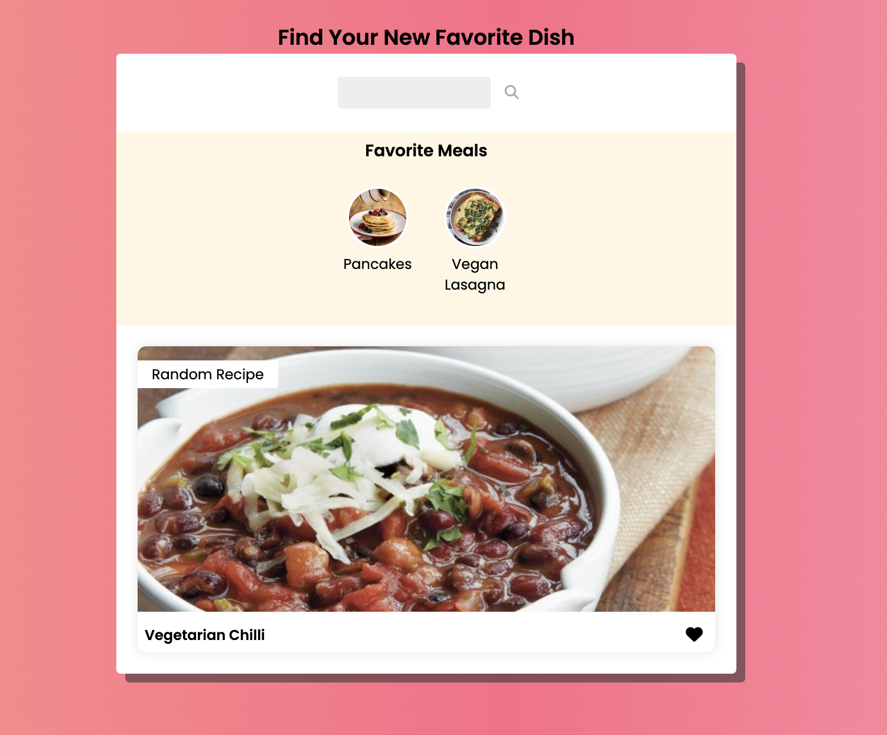
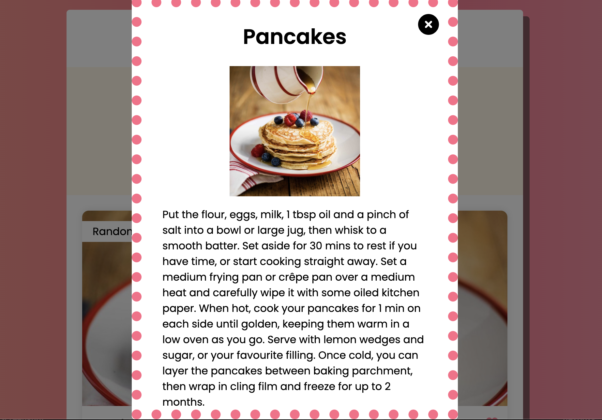

# Recipe Search Interface
Tired of always eating the same meals? This responsive, user-friendly interface not only lets you search for specific recipes, but also presents a random one for you to expand your culinary experience.

# Preview

# Technologies Used
Javascript, HTML5, CSS3, MealDB API

# Getting Started
https://gcastrocastro.github.io/recipe-app/

# Next Steps
- Add a dark mode for nighttime viewing
- Transition into a full stack app where users can make a profile and save their own favorite recipes. 

